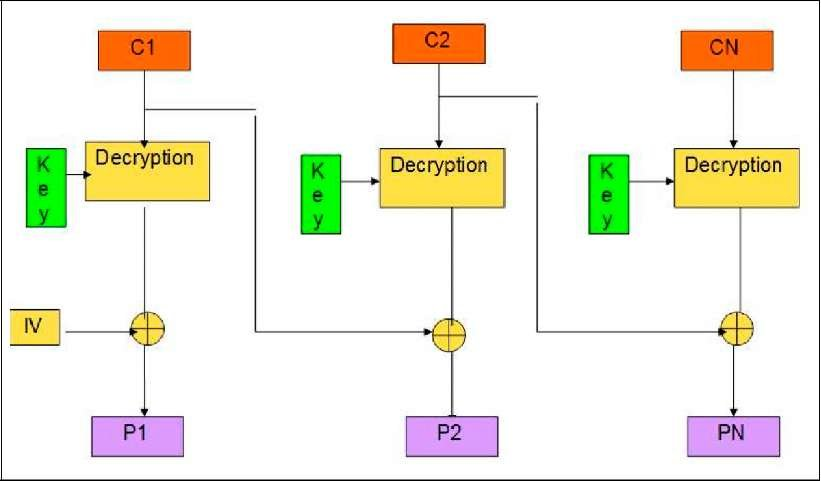

Ok this one took me a long time to solve.

I first looked at the login and register flows, tried to sqli them but with no success.
The prepared statements work I guess.

I spotted that the verify_credentials function isn't safe from sqli.

I then tried to inject into password because it is not checked, but I then saw the md5 so no luck there.

Then I had an idea to put into username something/meow, so then the password would be meow in the auth() function and not the md5 and then I could inject something, but the ctype_alnum check fucked me up.

After a while, even if I tried to avoid it, I tried researching about the encryption of the cookie and decryption and see if there are any vulnerabilites for it.
And I found the "Oracle Padding Attack" and more specifically "Bit Flipping Attacks".

This is a logical vulnerability in the CBC encryption method which can help you change the encrypted string so you control certain parts of the decrypted content.

I'm pasting 2 good videos that helped me learn about these attacks:
- https://www.youtube.com/watch?v=O5SeQxErXA4
- https://www.youtube.com/watch?v=Q6wopwjhyig

The plan is that I can change the encrypted session token, so in the auth function the username is admin, and the statement in the verify_credentials() function returns true.

The problem with the Bit Flipping Attack is that If I can control one block, the one before it will get scrambled.

So in this image, if I change the C1 so I can control P2, P1 will get scrambled because it uses C1 as well for decryption.
This means that I need to think carefully what I change so I can deal with scrambled strings in my payload.

Looking at the code, each block size is 16 bytes, and by coincidence this is the first block which is 16 bytes long: "user/pass:admin/"

This means that I need to keep this block, then I have to deal with a random block as the next block, then I can control the 3rd block and so on.

I constructed a payload like this: "user/pass:admin/{random}' OR 1=1;{random}" Which will work because the first random string will get put into password, which will reutrn false, then I will escape it and add a statement that is always true, and comment the rest so we don't care about the random after as well.

Quick note - CBC uses PKCS padding so I implemented it on my own so everything works fine.

As you can see in the [script](./script.py) I've automated it all and got the flag.
